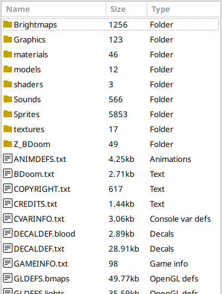

# Из чего состоит проект

В проекте все файлы делятся на следующие категории:

- Ресурсы: спрайты, звуки, UI-графика, музыка, 3D-модели и так далее, и тому подобное.
- Код, то есть поведение игры и всех, кто её населяет.
- Конфигурация. Информация для движка о том, что с чем нужно связывать.
- Уровни.
- Различные другие файлы — например, текстовая лицензия или файл благодарностей. Если файл оказывается в этой категории (если движок не может отнести файл к одной из категорий выше), то игра не будет пытаться его как-то интерпретировать.

В движках Doom, если при добавлении **ресурса** или **уровня** оказывается, что файл с таким названием уже был, то старый файл ресурса или уровня заменяется новым. Таким образом делаются сборники карт, а также простые модификации только с заменой спрайтов или звуков.

С **кодом** и **конфигурацией** взаимодействие сложнее, но в общем случае содержимое старого и нового файлов, грубо говоря, объединяется.

Проект необязательно должен включать в себя сразу все категории. На самом деле он вполне может состоять только из кода (например, нового поведения уже существующих противников), только из ресурсов или только из уровней.

## Редактор

Обычно для работы с проектами используют [редактор Slade](https://slade.mancubus.net/index.php?page=downloads); подробнее можно найти в [статье про редакторы и работу с проектом](../1-Введение/1.2-Редакторы.md#редактор-slade).

/// caption
Рисунок 1. Интерфейс редактора Slade
///

- В верхней части находится меню, блок быстрых действий и настройка базовых ресурсов.

- Слева располагается панель проектов (её можно включить или отключить через пункт меню "View" → "Archive Manager"). По умолчанию она делится по вертикали на проекты, открытые сейчас, и на недавние проекты.

- Правее находится список всех объектов внутри выбранного архива, в нём можно выбирать файл для редактирования. Снизу расположены поля фильтров.

- Справа — область просмотра и редактирования. В ней будет отображаться содержимое выбранного файла.

## Создание проекта и добавление ZScript {#создание-проекта}

Для создания проекта сейчас проще всего использовать редактор Slade. Предварительная настройка Slade описана в разделе "[Предварительная настройка Slade](../1-Введение/1.2-Редакторы.md#предварительная-настройка-slade)".

В следующих статьях будут описаны и [способы работы без редактора _\[TODO\]_](404), однако Slade сразу предоставляет массу полезных возможностей (например, расцветку синтаксиса ZScript), так что в первом проекте имеет смысл пользоваться им.

### Формат проекта PK3 {#формат-проекта-pk3}

Проект может делать в разных форматах. Формат проекта PK3 (файлы с расширением \*.pk3) один из самых простых и популярных, если говорить о движке ZDoom или его производных.

На самом деле PK3 является чуть-чуть модифицированным ZIP-архивом, поэтому имеет все те же свойства — в частности, тоже может содержать и файлы, и каталоги. Каталог, расположенный на верхнем уровне, называется _корневым каталогом_, или _корнем_ проекта.

Пути внутри PK3 записываются как и в обычных файловой системе; косая черта должна быть прямой (`/`), а не обратной (`\`). Так, например, чтобы обратиться к файлу `Hello_world.png`, расположенному в каталоге `Interface`, который лежит в каталоге `Graphics`, обычно пишут "`Graphics/Interface/Hello_world.png`". Также в документации может встретиться указание пути с косой чертой в начале — таким образом подчёркивается то, что путь начинается с корневого каталога: "`/Graphics/Interface/Hello_world.png`".

На рисунке 2 показано начало списка файлов из [модификации "Beautiful Doom"](https://www.moddb.com/mods/beautiful-doom-6100) за авторством Agent_Ash:

/// caption
Рисунок 2. Пример списка файлов в PK3
///

Скриншот сделан в редакторе Slade, и в общем очень похож на папку в Проводнике Windows.

### Создание PK3 {#создание-pk3}

В Slade нужно нажать на "File" → "New" → "Archive" (или комбинацию клавиш `Ctrl + Shift + N`). Так как PK3 — на самом деле ZIP-архив, в открывшемся меню нужно выбрать создания нового ZIP, как показано на рис. 3:

/// caption
Рисунок 3. Выбор формата ZIP, он же PK3
///

Затем можно сразу сохранить проект через "File" → "Save" или через комбинацию клавиш `Ctrl + S`, выбрав имя файла проекта и путь до него.

### Добавление ZScript {#изменения-файла-zscript}

Для того, чтобы работать с языком программирования ZScript, необходимо добавить в него соответственный файл кода. Новый файл в проект добавляется либо через меню "Archive" → "New Entry", либо через комбинацию клавиш  `Ctrl + N`. Этот файл, как показано на рис. 4, должен располагаться в корневом каталоге ("/") и иметь тип "Текст":

/// caption
Рисунок 4. Создание файла ZScript
///

Проект создан, и в него добавлен головной файл кода ZScript. Код ZScript — это текст на (сравнительно) понятном человеку языке, которые по строгим правилам описывают поведение, требуемое от движка. При загрузке проекта движок переводит этот текст в собственные, внутренние команды.

Изменения при запуске движка будут видны только после сохранения в Slade всего проекта. Для этого, как упоминалось выше, можно использовать пункт меню "File" → "Save" или комбинацию клавиш `Ctrl + S`.

В некоторых версиях Slade **перед** редактированием текстовых файлов ещё придётся нажать на пункт "View as Text" в верхней-правой части панели просмотра.

* * *

Можно считать, всё готово. Пора начинать [создавать первый мод](2.2-Простой_декоративный_актор.md).
