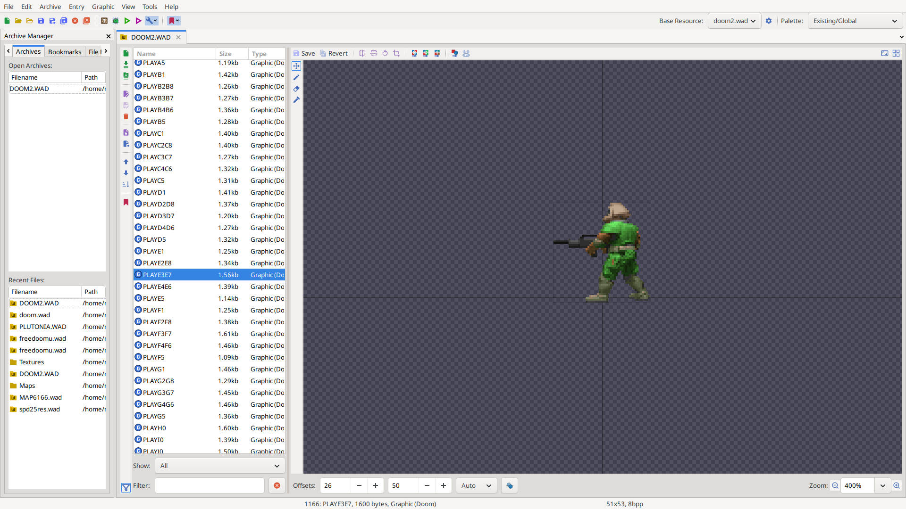
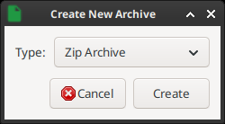
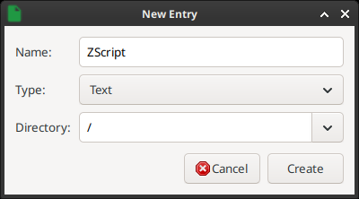

# Из чего состоит проект

!!! abstract "TODO"
	В нескольких предложениях описать ресурсы, код и, может, формат \*.pk3.

## Редактор

Обычно используют [редактор Slade](https://slade.mancubus.net/index.php?page=downloads); подробнее можно найти в [статье про редакторы и работу с проектом](../1-Введение/1.2-Редакторы.md#редактор-slade).

/// caption
Рисунок 1. Интерфейс редактора Slade
///

- В верхней части находится меню, блок быстрых действий и настройка базовых ресурсов.

- Слева располагается панель проектов (её можно включить или отключить через пункт меню "View" → "Archive Manager"). По умолчанию она делится по вертикали на проекты, открытые сейчас, и на недавние проекты.

- Правее находится список всех объектов внутри выбранного архива, в нём можно выбирать файл для редактирования. Снизу расположены поля фильтров.

- Справа — область просмотра и редактирования. В ней будет отображаться содержимое выбранного файла.

## Создание проекта и добавление ZScript {#создание-проекта}

Для создания проекта сейчас проще всего использовать редактор Slade и формат \*.pk3-архива. Предварительная настройка Slade описана в разделе "[Предварительная настройка Slade](../1-Введение/1.2-Редакторы.md#предварительная-настройка-slade)".

В следующих статьях будут описаны и [способы работы без редактора _\[TODO\]_](404), однако Slade сразу предоставляет массу полезных возможностей (например, расцветку синтаксиса ZScript), так что в первом проекте лучше пользоваться им.

### Создание архива PK3 {#создание-pk3}

Нужно нажать на "File" → "New" → "Archive" (или комбинацию клавиш `Ctrl + Shift + N`). Так как PK3 — на самом деле ZIP-архив, в открывшемся меню нужно выбрать создания нового ZIP, как показано на рис. 2:

/// caption
Рисунок 2. Выбор формата ZIP, он же PK3
///

Затем можно сразу сохранить проект через "File" → "Save" или через комбинацию клавиш `Ctrl + S`.

После этого необходимо добавить в него файл кода ZScript — новый файл в проект добавляется либо через меню "Archive" → "New Entry", либо через комбинацию клавиш  `Ctrl + N`. Этот файл, как показано на рис. 3, должен располагаться в корневом каталоге ("/") и иметь тип "текст":

/// caption
Рисунок 3. Создание файла ZScript
///

### Об изменении файла ZScript {#изменения-файла-zscript}

Проект создан, и в него добавлен головной файл кода ZScript. Код ZScript — это текст на (сравнительно) понятном человеку языке, которые по строгим правилам описывают поведение, требуемое от движка. При загрузке проекта движок переводит этот текст в собственные, внутренние команды.

Изменения при запуске движка будут видны только после сохранения в Slade всего проекта. Для этого, как упоминалось выше, можно использовать пункт меню "File" → "Save" или комбинацию клавиш `Ctrl + S`.

В некоторых версиях Slade **перед** редактированием текстовых файлов ещё придётся нажать на пункт "View as Text" в верхней-правой части панели просмотра.

* * *

Можно считать, всё готово. Пора начинать [создавать первый мод](2.2-Простой_декоративный_актор.md).
