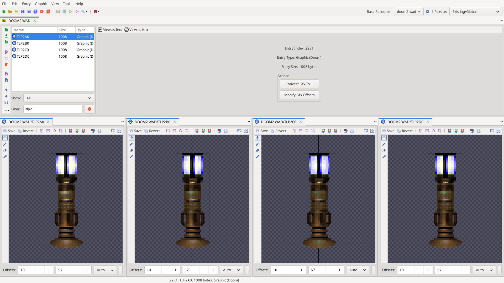

# Простой декоративный актор

Актор — это объект внутриигрового мира, например, предмет, враг, декорация (в том числе неосязаемая, как дымок от пули) или сам игрок. Так, все акторы, видимые на скриншоте на рис. 1, обведены красными овалами:


/// caption
Рисунок 1. Акторы обведены красным
///

Все акторы реагируют на внешние воздействия по-разному — предметы могут подбираться, противники, игрок и часть декораций получают урон, монстры реагируют на появление игрока в поле зрения, и тому подобное; но базовое объявление у них у всех одинаково и строится по строгим правилам языка. Для начала начнём с простейшего — декорации.

Итак, после статьи 2.1 [проект создан, файл кода ZScript добавлен](../2.1-Из_чего_состоит_проект/#zscript). Наш файл ZScript сейчас чист, и если мы попробуем запустить такой пустой проект, то никаких видимых изменений не произойдёт.
Чтобы что-то поменялось, нужно сообщить движку, что именно мы хотим; а хотим мы объявить новый, собственный объект игрового мира — нового актора.


## Объявление актора {#объявление-актора}

В ZScript объявление нового актора записывается по следующему шаблону:

```CPP
class Название_Актора: Actor {

}
```

На месте `Названия_Актора` должно стоять, собственно, внутреннее название актора — по нему движок будет понимать, что речь идёт именно о нём, и сможет создавать его копии. У названия есть свои правила:

- Должно состоять **только** из символов латинского алфавита, символа нижнего подчёркивания `_` и цифр. _Никаких пробелов, кириллицы, точек, кавычек и всего остального! В шаблоне выше русские слова даны только для упрощения восприятия!_
- Первым символом в названии не может стоять цифра.
- Желательно не пересекаться с существующими названиями.

В рамках этих ограничений название может быть любым, хотя обычно оно просто отражает суть актора. К примеру, в этой статье мы будем создавать напольную техническую лампу:
```CPP
class ImpulseFloorLamp: Actor {

}
```
В первой строчке мы сообщаем сообщаем движку, что создаём новый Actor с названием `ImpulseFloorLamp` ("Импульсная напольная лампа", почему бы и нет) — эта часть называется _заголовком_ актора. Затем, с помощью скобок `{ }`, объявляем начало и конец _тела актора_ — всё, что находится внутри _тела_, будет связано с актором.

Фигурные скобки `{ }` называются _операторными скобками_, они показывают движку, где начинается и где заканчивается логическая часть кода. В следующих главах будет дано подробное объяснение, в каких случаях их необходимо ставить, но пока что скобки можно просто копировать.

В Slade написанный код должен выглядеть примерно так, как на рис. 2:


/// caption
Рисунок 2. Открытый файл ZScript в редакторе кода Slade
///

(Далее интерфейс редактора Slade остаётся таким же, так что, кроме самых важных моментов, больше показываться не будет.)

### Объявление нескольких акторов {#объявление-нескольких-акторов}

Теперь движок, если его запустить вместе с проектом, будет знать о нашем акторе! Важно понимать, что на данный момент актор просто "абстрактно существует" — он не появится просто так в мире, и даже если его призвать вручную, то не будет делать ровным счётом ничего. Однако теперь нам известен шаблон объявления. А значит, можем создавать другие заготовки, которые впоследствии, когда-нибудь, будут населять новые цифровые вселенные.

Конечно, файл кода можно отредактировать в любой момент, необязательно добавлять всё сразу. Но ниже, для примера, к объявленной ранее импульсной лампе добавлены ещё два актора, под креативными названиями `MyActor2` и `Lorem_Ipsum`.
```CPP
class ImpulseFloorLamp: Actor {

}


class MyActor2: Actor {

}

class Lorem_Ipsum: Actor {

}
```

Чисто пустых строк между соседними объявлениями совершенно неважно, главное — чтобы эти объявления не оказались случайно вложены друг в друга (всё же это независимые акторы, один не может быть частью другого).

---

В целом объявлений акторов может быть сколь угодно много, однако пока вернёмся только к коду напольной импульсной лампы.

### Замена других акторов нашим {#замена-акторов}

Сразу необходимо затронуть ещё одну тему. Как говорилось выше, сам по себе в мире актор никогда не появится: его нужно либо поставить на карте через редактор уровней или создать каким-либо другим кодом, что выходит за рамки этой статьи, либо призвать через консольную команду отладки.

Но в модификациях существующие объекты обычно просто заменяются собственными — и в движках семейства \*ZDoom это настолько частое действие, что для него сделан отдельный способ записи.

Для того, чтобы заменить все акторы на карте своими, необходимо в заголовке после слова `Actor` дописать ` replaces Название_Заменяемого`. Тогда на месте `Названия_Заменяемого` должно стоять название того актора, который будет заменён нашим по всему уровню:

```CPP
class ImpulseFloorLamp: Actor replaces Zombieman {

}
```
В этом объявлении все зомби-рядовые (внутреннее название которых — `Zombieman`) заменяются на наш актор `ImpulseFloorLamp`. Пока что будем пользоваться таким способом.

### Запуск! Промежуточный результат {#запуск-1}

Итак, первая проверка модификации.

!!! note "Напоминание"
	Запустить проект можно, например, мышкой перетащив сохранённый \*.pk3 или директорию на икноку UZDoom (или другого подходящего порта, как GZDoom, LZDoom, VkDoom и QZDoom). Вообще, для Doom есть множество лаунчеров, облегчающих добавление модификаций.
	
	Также можно использовать командную строку и запустить `uzdoom -file Путь` из-под директории с движком. Если, например, использовать один из параллельных форков движка (положим, LZDoom) и назвать файл проекта "Simple_decorative_actor.pk3", то запускать нужно `lzdoom -file Simple_decorative_actor.pk3`.

!!! question "Не запускается?"
	Если при запуске проекта сообщается об ошибках в коде — вероятнее всего, были нарушены правила синтаксиса языка программирования, из-за чего движок просто не понимает, что от него требуется. Можно поразбираться, всё ли сделано по шаблону, не забыта ли какая-нибудь скобка. И, конечно, _пока_ есть готовые примеры, их всегда можно скопировать...

Запускаем, и... внезапно, не видим ничего. Настолько ничего, что исчезли даже оба врага, извечно стоявших здесь! Хотя можно убедиться, что остальные объекты на уровне, кроме всех зомби-рядовых, остались на своих местах.


/// caption
Рисунок 3. Первый запуск мода
///

На самом деле всё в порядке, актор объявлен, движок о нём знает, и "физически" в игровом мире на месте всех `Zombieman` он действительно появился — но по умолчанию актор не имеет спрайтов (картинок), и на экране попросту не отображается...

Чтобы его увидеть, необходимо связать с ним нужные спрайты.


## Отображение. Спрайты и анимации {#спрайты}

Все спрайты и анимации акторов задаются _стейтами_ — минимальными состояниями актора: то, как он в каждый отдельно взятый момент должен отображаться в игре (а в следующих статьях — ещё и какое действие должен исполнить). Каждый стейт включает в себя как минимум:

1. Спрайт и его фрейм (кадр спрайта);
2. Продолжительность стейта в тактах игры (1/35 секунды);
3. Какой стейт должен идти следующим.

Соответственно, если объединить несколько стейтов подряд, получится анимация, или _последовательность стейтов_. В начале последовательности стейтов обычно ставится _метка стейта_ — читаемое название этой последовательности. **Все появляющиеся в мире акторы начинают проигрывать стейты от метки** `Spawn:` (в свободном переводе — "Создание" или "Появление").

Стейты актора задаются через так называемый "Блок стейтов", в коде записывается как `States { }`. Так как это тоже логический блок, то пишется он тоже с операторными скобками, как и `class …`, но уже внутри актора:
```CPP
class ImpulseFloorLamp: Actor replaces Zombieman {
	States {

	}
}
```
Если бы `States { }` был расположен вне актора, движок не мог бы понять, с чем именно ему нужно связать блок стейтов.

Итак, мы создаём техническую напольную лампу, поэтому можно взять уже готовые спрайты из Doom с названиями файлов `TLP2A0`, `TLP2B0`, `TLP2C0` и `TLP2D0`. Они уже существуют в DOOM.WAD и DOOM2.WAD, поэтому никаких дополнительных ресурсов подключать не требуется — но при желании, разумеется, эксперименты и добавление собственных спрайтов только приветствуется!


/// caption
Рисунок 4. Все кадры спрайта одной из напольных ламп Doom
///

[Напомним _\[пока статьи нет, TODO\]_](2.1-Из_чего_состоит_проект.md), что в спрайтах первые четыре символа и будут названием спрайта, а последующие пары символов — это фрейм и поворот спрайта. Нумерация фреймов начинается с латинской буквы "A", затем "B", "C" и так далее. Если на позиции поворота указан ноль, как в нашем случае, то объект всегда будет повёрнут к игроку одной стороной. Так, в упомянутом выше файле спрайта `TLP2D0` название спрайта будет "TLP2" (сокращение от англ. "**T**ech **L**am**p 2**", "Техническая лампа 2"), конкретный фрейм — "D" (четвёртый), и этот спрайт будет всегда повёрнут в камеру игрока.

### Правила записи стейтов

!!! tip "В двух словах о конвертации из Decorate"
	Если Вам уже известен **Decorate**, то синтаксис стейтов в общем случае в ZScript такой же. Достаточно только в конце каждой строки добавить символ окончания инструкции — точку с запятой, `;`.

Внутри блока стейтов сами стейты записываются по правилам "`НАЗВАНИЕ КАДР ЗАДЕЖРКА;`" и исполняются последовательно, сверху вниз. Метки стейтов, в том числе и начальная `Spawn:`, обозначаются с двоеточием в конце.
```CPP
class ImpulseFloorLamp: Actor replaces Zombieman {
	States {
	Spawn:
		TLP2 A 5;
		TLP2 B 5;
		TLP2 C 5;
		TLP2 D 5;
		Loop;
	}
}
```
В этом примере анимация состоит из четырёх фреймов спрайта "TLP2", все задержки равны 5 (то есть 5/35 секунды, или примерно 0.14 на каждый кадр анимации).

- Первым стейтом после метки `Spawn:` здесь стоит стейт "TLP2 A 5".
- Он сменяется на "TLP2 B 5",
- …Потом на "TLP2 C 5",
- …Затем на "TLP2 D 5".
- В конце встречается инструкция `Loop;`, означающая «Перейди на начало текущей именованной последовательности стейтов» — и стейт "TLP2 D 5" переходит на `Spawn:`, то есть вновь на исходный "TLP2 A 5",
- …Который вскоре снова сменяется на "TLP2 B 5",
- …И так бесконечно, по кругу.

!!! note "Запуск проекта"
	При загрузке проекта сейчас будут видны некоторые странности в физике ламп, пока это нормально. Все аномалии будут упомянуты в [следующем подзаголовке запуска](#запуск-2).

Можно уже заняться гейм-дизайном: добавить новые фреймы (или даже спрайты) и заменить часть задержек. У нас же импульсная лампа — значит, явно покажем этот импульс! Например, так:
```CPP
class ImpulseFloorLamp: Actor replaces Zombieman {
	States {
	Spawn:
		TLP2 C 30;
		TLP2 D 5;
		TLP2 A 4;
		TLP2 D 1;
		TLP2 A 2;
		TLP2 B 5;
		Loop;
	}
}
```
Количество стейтов в одном акторе не ограничивается, как и возможность использования одного и того же фрейма в разных местах анимации.

Ещё удобной деталью является запись нескольких кадров одинаковой длительности. Так, в блоке кода ниже на самом деле четыре стейта: "TLP2 A" с задержкой "30", затем "TLP2 B", "TLP2 C" и "TLP2 D" с задержкой "4". В конце опять зацикливание на "TLP2 A".
```CPP
class ImpulseFloorLamp: Actor replaces Zombieman {
	States {
	Spawn:
		TLP2 A 30;
		TLP2 BCD 4;
		Loop;
	}
}
```

!!! warning "Нулевые задержки"
	Задержка "0" (как в записи `TLP2 A 0;`) в стейтах применяется, но необходимо следить, чтобы в коде не было непрерываемых последовательностей, состоящих только из нулевых задержек. Во многих версиях движков автопрерывания стейтов не существует, и такие циклы будут намертво вешать игру.

Забавно, но при экспериментах можно заметить, что спрайты "TLP2 B" и "TLP2 D" из ресурсов Doom различаются буквально двумя-тремя пикселями в нижней части лампы.

Итак. Стейты — крайне важная тема для актора (в конце концов, без них его даже видно не будет). Многим подробнее они будут рассмотрены в статье через одну, "[Простой актор-противник](2.3-Простой_актор-противник.md)". А пока попробуем запустить...

### Запуск-2! Промежуточный результат {#запуск-2}

При запуске Doom 2 MAP01 видна странная картина, как на рис. 5. Все зомби-рядовые заменились на написанные нами лампы (да, пока что они тёмные):


/// caption
Рисунок 5. Запуск после установки спрайтов
///

Можно подойти к ним, попробовать потрогать — но есть одно огромное "но": лампа получилась призрачная. Помимо того, что она тёмная, так ещё и неосязаемая!

Обе эти проблемы решают _свойства и флаги актора_. Это информация для игрового движка о том, какая у актора должна быть высота и объём, как должен отрисовываться, какие звуки ему нужно воспроизводить, должен ли парить в воздухе или находиться на земле, и так далее, и тому подобное. Свойств и флагов актора огромное количество, несколько сотен, но основных из них не так много.


## Свойства и флаги актора {#свойства-и-флаги}

!!! abstract "TODO"
	_О блоке `Default {}`._


## Результат {#результат}

В итоге должен получиться примерно такой код:

```CPP
class ImpulseFloorLamp: Actor replaces Zombieman {
	Default {
		+SOLID;
		+BRIGHT;
		Radius 8;
		Height 48;
	}

	States {
	Spawn:
		TLP2 A 30;
		TLP2 BCD 4;
		Loop;
	}
}
```

<br>

Призывать наш актор в произвольном месте можно с помощью команды консоли "`summon Название`" (консоль открывается по нажатию на тильду `~`, на русской раскладке это буква `Ё`):
```
summon ImpulseFloorLamp
```


/// caption
Рисунок 6. Пять личных импульсных ламп
///

---

С этим актором уже можно экспериментировать — задавать разные свойства, менять спрайты и кадры анимации, или не подменять существующих акторов (убрать `replaces Название`). Следующая статья будет про [синтаксис, семантику, ошибки и комментарии](2.3-Синтаксис_Семантика_Комментарии.md) — про важные понятия, которые сильно пригодятся в будущем.

И уже за ней, в статье "[Простой актор-противник](2.4-Простой_актор-противник.md)", основное внимание будет уделено поведению актора и воздействию на игровой мир, изменению стейтов и вызову функций.
