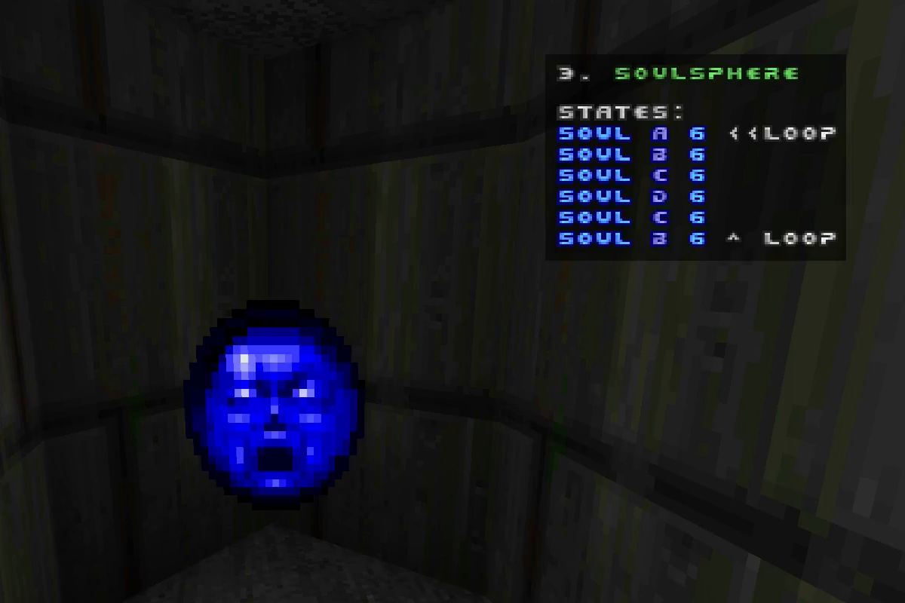

# Простой актор-противник

В [прошлой статье](2.2-Простой_декоративный_актор.md) мы разобрались с базовым объявлением новых акторов — объектов мира. Здесь будет затронуто две важные темы, по которым ранее было сказано только вскользь — это _машина изменения стейтов_ и _наследование_.

Однако перед этим необходимо упомянуть о синтаксисе и семантике, а также о самой важной вещи в любом языке программирования: о комментариях.


## Синтаксис и семантика кода

Часто эти два понятия употребляются рядом.

- Синтаксис — это формальные правила записи кода; то, как он должен выглядеть, чтобы компьютер в нём разобрался.
- Семантика — это переданный смысл, то есть то, как его на самом деле воспринимает человек и что в результате по нему делает компьютер.

Напомним, что итоговый код из предыдущей статьи выглядел примерно так:
```CPP
class ImpulseFloorLamp: Actor replaces Zombieman {
	Default {
		+SOLID;
		+BRIGHT;
		Radius 8;
		Height 48;
	}

	States {
	Spawn:
		TLP2 A 16;
		TLP2 BCDCB 2;
		Loop;
	}
}
```
Здесь слова вроде `States`, `class`, числа, а также символы по типу `{ }` и `;` находятся в определённых позициях друг относительно друга, которые определяются жёсткими формальными правилами, по которым строится язык программирования. Это — _синтаксис_.

Ошибка (или "баг") в правилах записи называется _синтаксической ошибкой_. Такие ошибки движок без труда определяет и, так как не имеет права "додумывать" за пользователя, что тот имел в виду, просто отказывается запускаться вместе с проектом.

<br>

Вместе с тем, в коде выше намётанному глазу также сразу видны:

1. Объявление нового актора и замена им другого;
2. Логический блок свойств сверху, определяющей непроходимую декорацию;
3. Блок стейтов, показывающий простую зацикленную анимацию.

Да, записывается это всё синтаксическими конструкциями, но передают смысл. Это — _семантика_.

Ошибка (баг) в логике называется _семантической ошибкой_. Они несравнимо сложнее для автоматического отлова, движок только в самых очевидных случаях может определить некорректность написанного. Зачастую такие ошибки проявляются непосредственно во время игры, а не при запуске проекта.

Процесс избавления от ошибок называется _отладкой_ (_дебагом_). Зачастую, чем запутаннее код, тем сложнее в нём будет найти внезапно появившийся баг, и, соответственно, тем дольше впоследствии придётся заниматься отладкой. Так что правило "Будь проще!" применимо и к программированию.

Поддерживать порядок в коде и отлаживать подозрительные места помогут комментарии.


### Комментарии

!!! abstract "TODO"
	_Комментарии в стиле C. Пока что они есть в [разделе 3](/3-Синтаксис_и_семантика/#_3)._


## Стейты


!!! abstract "TODO"
	_Стейты, подробно на понятийном уровне._

```CPP
class Soulsphere : Health
{
	// <...>

	States
	{
	Spawn:
		SOUL ABCDCB 6 Bright;
		Loop;
	}
}
```


/// caption
Рисунок 1. Смена стейтов соулсферы
///

