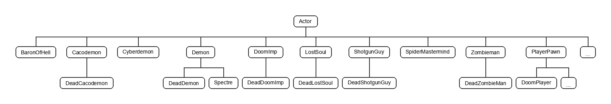
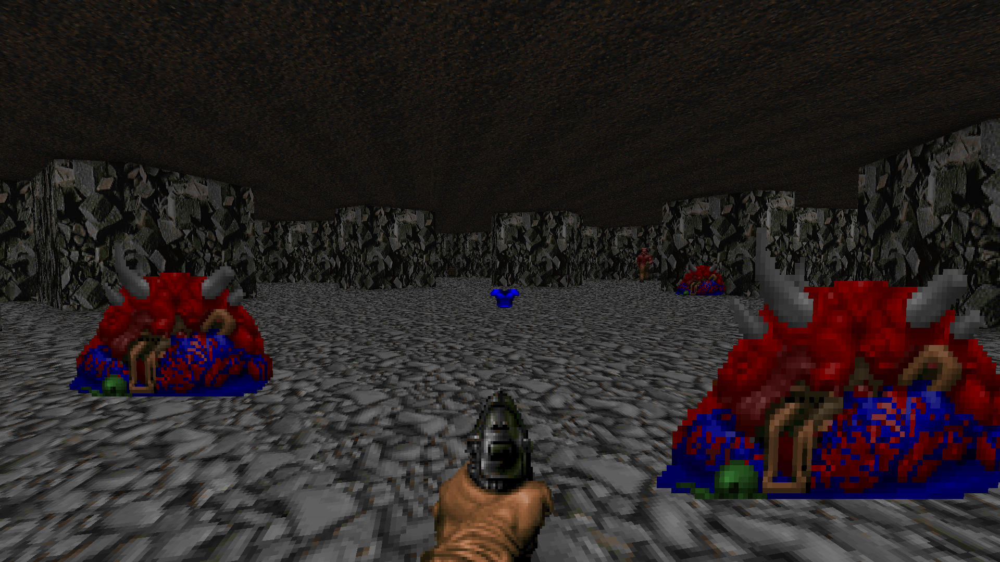

# Простой актор-противник

Здесь будут затронуты три важные темы, о которых ранее говорилось только вскользь — _машина изменения стейтов_, _классы_ и _наследование_.

<!-- Оглавление: "О стейтах, кодпоинтерах, переходах по ним, и отсылках на Decorate." -->


## Классы {#классы}

Следует познакомиться с такими основополагающими и неразрывно связанными вещами, как _класс_ и _объект_. Понятия это абстрактные, поэтому проще будет их осознать, применив к актору (объекту мира):

- Класс — это общее описание того, как он должен действовать. Всё, что объявляется в коде, является классом.

- Объект — это конкретная, "живая" копия класса `Actor`, существующая во внутриигровом мире. Другое название — _экземпляр_ класса.

Таким образом, все акторы, что мы ранее объявляли в ZScript, были _классами_, в том числе класс `ImpulseFloorLamp`. А все акторы, которые "вживую" появлялись в игре — это уже _объекты_, или _экземпляры_, класса `ImpulseFloorLamp`. Штамповать объекты в игре можно бесконечно, количество экземпляров одного класса не ограничивается.

Если отойти от игрового мира Doom, обобщить понятия на абстракцию, то:

- Класс — это неизменяемое описание того, как должен действовать объект.
- Объект (или экземпляр) — это конкретная, "живая" копия класса, с которой можно взаимодействовать.

Минимальный класс в движке объявляется следующим образом:
```CPP
class Название_класса {
}
```
В этом случае класс будет иметь минимальный набор возможностей, всё остальное придётся вписывать в него вручную... Что, понятно, далеко не всегда удобно. Так что класс можно _наследовать_ от какого-то другого, сохранив все его свойства с добавлением собственных.


### Наследование классов {#наследование}

_Наследование классов_ — это создание нового класса на базе какого-то другого, _родительского_ класса. В этом случае копируется вся функциональность родительского, и новый _дочерний класс_ (также называется _подкласс_) можно начинать разрабатывать уже на чём-то готовом, а не с нуля.

В ZScript наследование записывается следующим образом:
```CPP
class Название_класса: Родительский_класс {

}
```
Здесь `Название_класса` будет иметь всё, что имел и `Родительский_класс`, а также может добавить что-то своё. Мы уже встречались с этим ранее, вспомним объявление [напольной импульсной лампы](2.2-Простой_декоративный_актор.md#объявление-актора):
```CPP
class ImpulseFloorLamp: Actor {

}
```
Да, в данном случае "Actor" — это не какое-то магическое слово, а просто название класса... Таким образом мы сообщаем движку, что наш `ImpulseFloorLamp` будет иметь все те же возможности, что и класс `Actor`.

Хороший пример наследования — это Demon (который пинки) и наследованный от него Spectre (спектр) из Doom:

1. Пинки — актор, в котором реализованы все свойства и все стейты пинки-демона. Его объявление выглядит как `class Demon: Actor { … }`, и внутри "…" написано 48 строк кода.
2. Спектр наследуется от класса `Demon`, его объявление записывается как `class Spectre: Demon { … }`. На месте "…" у него добавлено свойство невидимости, другая надпись-некролог при смерти игрока и ещё некоторые специфичные свойства — общее число строк составляет 13, так как в нём **уже** есть всё то, что добавлено в классе `Demon`, ему просто не нужно прописывать ничего второй раз!

Полное _дерево подклассов_ класса `Actor` выглядит довольно громоздко, так как включает в себя всех акторов со всех поддерживаемых игр. На рис. 1 дан сильно упрощённый вариант, на котором показан только игрок и противники из Doom 1 ([прямая ссылка на картинку](2.4_Дерево_классов_врагов_Doom.png)):


/// caption
Рисунок 1. Дерево классов противников из Doom 1
///

По рисунку 1 видно, что:

- От `Actor` наследуются `BaronOfHell`, `Cacodemon`, `Cyberdemon`, `Demon` и другие противники.
- От `Demon`, как упоминалось ранее, наследуется `Spectre`.
- От некоторых других из классов наследуется ещё один класс с приставкой `Dead`. Это декорации, а именно уже мёртвые монстры, местами разложенные по уровням (см. рис. 2 ниже).
- А также выделен класс `PlayerPawn`, от которого наследуется и класс `DoomPlayer`, физическая фигурка самого игрока; на деле от выделенного класса наследуются и другие акторы игроков — например, в Hexen играбельный персонаж воин Баратус будет классом `FighterPlayer`. То есть класс `PlayerPawn` содержит всю основную логику обработки актора игрока, но при этом сам по себе в игре никогда не используется.


/// caption
Рисунок 2. Doom 1, E2M9. Какодемоны в виде декораций
///


!!! note "Это [интересно]"
	Полное дерево подклассов класса `Actor` можно увидеть на [этой картинке](2.4_Дерево_подклассов_Actor.png) (2 мегабайта). На ней дерево растёт слева направо, то есть родительский класс всегда будет слева от дочернего. Класс `Actor` самый левый.
	
	Сам по себе класс `Actor` тоже является наследником другого класса, `Thinker`, который, в свою очередь, наследуется уже от базового класса игрового движка.


### Классы и объекты в двух словах {#классы-и-объекты-в-двух-словах}

Вкратце текущая теория по классам и объектам:

- Класс — статичный код, чертёж, форма, трафарет, по которому можно штамповать объекты.
- Объект — динамика, конкретный "живой" экземпляр своего класса.
- Класс можно наследовать от другого, родительского, с сохранением всех свойств последнего.
- Класс `Actor` — такой же класс, как и остальные. По нему создаются объекты, которые игрок видит в игровом мире.

Подробности можно найти в [разделе 3. Структурирование и ООП](../3-Синтаксис_и_семантика/3.3.1-Классы_и_структуры.md).


## Стейты {#стейты}

!!! abstract "TODO"
	_Стейты на понятийном уровне, подробнее._

```CPP
class Soulsphere : Health
{
	// <...>

	States
	{
	Spawn:
		SOUL ABCDCB 6 Bright;
		Loop;
	}
}
```


/// caption
Рисунок 1. Анимация смены стейтов соулсферы
///
